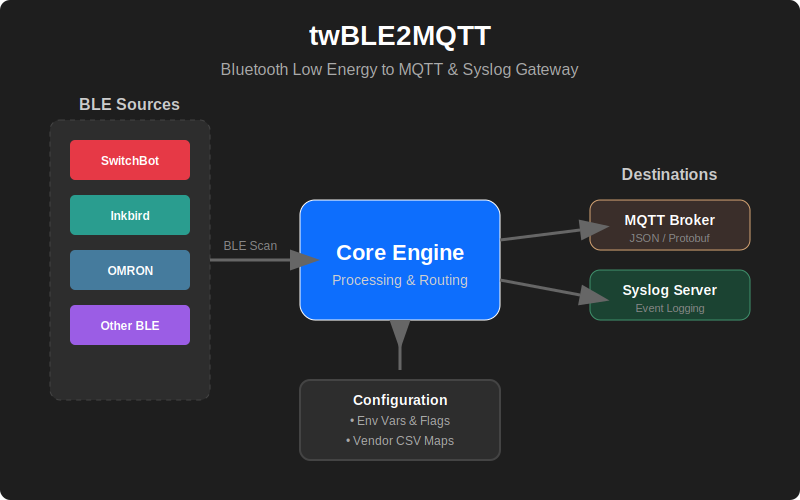

# twBLE2MQTT



twBLE2MQTTは、様々なセンサーのアドバタイズパケットを検出しデコードする、Bluetooth Low Energy (BLE) から MQTT へのゲートウェイです。Zigbee2MQTTにインスパイアされています。

## 特徴

- **BLEデバイス検出**: 周辺のBLEデバイスを自動的にスキャンし、存在、RSSI、およびメタデータを報告します。
- **センサーのデコード**: 以下の主要なBLEセンサーのアドバタイズデータをデコードします：
    - **SwitchBot**: 開閉センサー、温湿度計、CO2センサー、屋外温湿度計 (IP64)、プラグミニ。
    - **Inkbird**: 環境センサー (IBS-TH1, IBS-TH2 など)。
    - **OMRON**: 環境センサー。
- **複数の転送先**:
    - **MQTT**: センサーデータとデバイスステータスをJSON形式でMQTTブローカーにパブリッシュします。
    - **Syslog**: レポートやイベントを1つ以上のSyslogサーバーに送信します。
- **ベンダーマッピング**: 製造元コードやMACアドレスのプレフィックスを使用して、外部CSVマップを介してデバイスのベンダーを特定します。
- **柔軟な設定**: コマンドラインフラグと環境変数の両方をサポートしています。

## 動作環境

- **Go**: バージョン 1.25 以降。
- **対応OS**: 
    - Linux (BlueZがインストールされている必要があります)。
    - macOS (CoreBluetoothを使用)。
    - Windows。
- **ハードウェア**: 互換性のあるBluetoothアダプターが必要です。

## インストール / ビルド

### Goを直接使用する場合

現在のプラットフォーム向けにバイナリをビルドするには：

1. リポジトリをクローンします：
   ```bash
   git clone https://github.com/twsnmp/twBLE2MQTT.git
   cd twBLE2MQTT
   ```

2. バイナリをビルドします：
   ```bash
   go build -o twble2mqtt
   ```

### [mise-en-place](https://mise.jdx.dev/) を使用する場合

このプロジェクトは、Goツールチェーンの管理とビルドタスクの自動化に `mise` をサポートしています。

1. まだインストールしていない場合は、`mise` をインストールします。
2. サポートされているすべてのプラットフォーム（Linux, macOS, Windows）とアーキテクチャ（amd64, arm64, armv7）向けにビルドします：
   ```bash
   mise run build
   ```
   ビルドされたバイナリは `dist/` ディレクトリに生成されます。

3. ビルド成果物を削除する場合：
   ```bash
   mise run clean
   ```

## 使い方

### ゲートウェイの起動

MQTTまたはSyslogの少なくとも1つの転送先を指定する必要があります。

```bash
./twble2mqtt -mqtt tcp://localhost:1883 -syslog 192.168.1.100:514
```

### コマンドラインフラグ

| フラグ | 環境変数 | 説明 | デフォルト値 |
|------|----------------------|-------------|---------|
| `-mqtt` | `TWBLUESCAN_MQTT` | MQTTブローカーの接続先 (例: `tcp://broker:1883`) | "" |
| `-mqttUser` | `TWBLUESCAN_MQTTUSER` | MQTT ユーザー名 | "" |
| `-mqttPassword` | `TWBLUESCAN_MQTTPASSWORD` | MQTT パスワード | "" |
| `-mqttClientID` | `TWBLUESCAN_MQTTCLIENTID` | MQTT クライアント ID | `twBlueScan` |
| `-mqttTopic` | `TWBLUESCAN_MQTTTOPIC` | MQTT 基本トピック | `twBlueScan` |
| `-syslog` | `TWBLUESCAN_SYSLOG` | カンマ区切りのSyslog転送先リスト | "" |
| `-interval` | `TWBLUESCAN_INTERVAL` | 定期レポート送信の間隔（秒） | `600` |
| `-all` | `TWBLUESCAN_ALL` | すべてのアドレス（プライベート/ランダムを含む）を報告 | `false` |
| `-debug` | `TWBLUESCAN_DEBUG` | デバッグモードを有効化 | `false` |

### 環境変数

すべての設定フラグは、`TWBLUESCAN_` プレフィックスを付けた環境変数で上書きできます。

## ライセンス

このプロジェクトは Apache License 2.0 の下でライセンスされています。詳細は [LICENSE](LICENSE) ファイルを参照してください。
